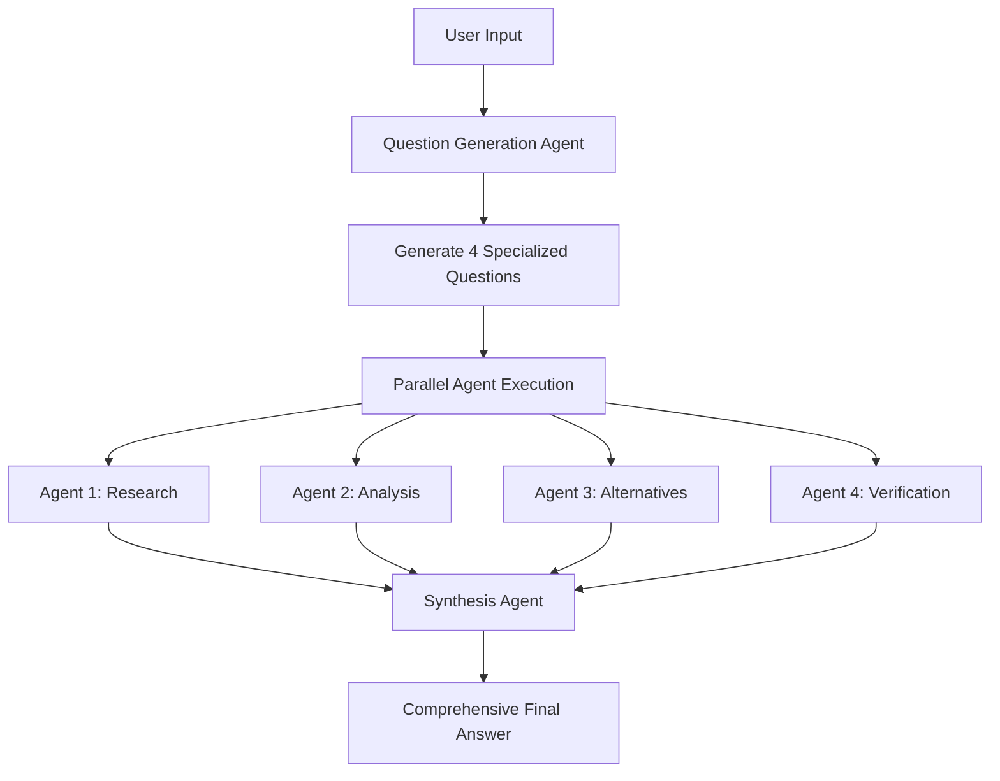

# 🚀 Chat with Tools

A Python framework to emulate **Grok heavy** functionality using a powerful multi-agent system. Built on OpenRouter's API, Chat with Tools delivers comprehensive, multi-perspective analysis through intelligent agent orchestration.

## 🌟 Features

- **🧠 Grok heavy Emulation**: Multi-agent system that delivers deep, comprehensive analysis like Grok heavy mode
- **🔀 Parallel Intelligence**: Deploy 4 specialized agents simultaneously for maximum insight coverage
- **🎯 Dynamic Question Generation**: AI creates custom research questions tailored to each query
- **⚡ Real-time Orchestration**: Live visual feedback during multi-agent execution
- **🛠️ Hot-Swappable Tools**: Automatically discovers and loads tools from the `tools/` directory
- **🔄 Intelligent Synthesis**: Combines multiple agent perspectives into unified, comprehensive answers
- **🎮 Single Agent Mode**: Run individual agents for simpler tasks with full tool access

## 🚀 Quick Start

### Prerequisites

- Python 3.8+
- [uv](https://github.com/astral-sh/uv) (recommended Python package manager)
- OpenRouter API key

### Installation

1. **Clone and setup environment:**
```bash
git clone <https://github.com/Suparious/chat-with-tools.git>
cd "Chat with Tools"

# Create virtual environment with uv
uv venv

# Activate virtual environment
source .venv/bin/activate  # On Windows: .venv\Scripts\activate
```

2. **Install dependencies:**
```bash
uv pip install -r requirements.txt
```

3. **Configure API key:**
```bash
# Edit config/config.yaml and replace YOUR API KEY HERE with your OpenRouter API key
```

## 🎯 Usage

### Single Agent Mode

Run a single intelligent agent with full tool access:

```bash
python demos/main.py
```

**What it does:**
- Loads a single agent with all available tools
- Processes your query step-by-step
- Uses tools like web search, calculator, file operations
- Returns comprehensive response when task is complete

**Example:**
```
User: Research the latest developments in AI and summarize them
Agent: [Uses search tool, analyzes results, provides summary]
```

### Grok heavy Mode (Multi-Agent Orchestration)

Emulate Grok heavy's deep analysis with 4 parallel intelligent agents:

```bash
python demos/council_chat.py
```

**How Chat with Tools works:**
1. **🎯 AI Question Generation**: Creates 4 specialized research questions from your query
2. **🔀 Parallel Intelligence**: Runs 4 agents simultaneously with different analytical perspectives
3. **⚡ Live Progress**: Shows real-time agent status with visual progress bars
4. **🔄 Intelligent Synthesis**: Combines all perspectives into one comprehensive Grok heavy-style answer

**Example Flow:**
```
User Query: "Who is Pietro Schirano?"

AI Generated Questions:
- Agent 1: "Research Pietro Schirano's professional background and career history"
- Agent 2: "Analyze Pietro Schirano's achievements and contributions to technology"  
- Agent 3: "Find alternative perspectives on Pietro Schirano's work and impact"
- Agent 4: "Verify and cross-check information about Pietro Schirano's current role"

Result: Grok heavy-style comprehensive analysis combining all agent perspectives
```

## 🏗️ Architecture

### Orchestration Flow



### Core Components

#### 1. Agent System (`agent.py`)
- **Self-contained**: Complete agent implementation with tool access
- **Agentic Loop**: Continues working until task completion
- **Tool Integration**: Automatic tool discovery and execution
- **Configurable**: Uses `config.yaml` for all settings

#### 2. Orchestrator (`orchestrator.py`)
- **Dynamic Question Generation**: AI creates specialized questions
- **Parallel Execution**: Runs multiple agents simultaneously  
- **Response Synthesis**: AI combines all agent outputs
- **Error Handling**: Graceful fallbacks and error recovery

#### 3. Tool System (`tools/`)
- **Auto-Discovery**: Automatically loads all tools from directory
- **Hot-Swappable**: Add new tools by dropping files in `tools/`
- **Standardized Interface**: All tools inherit from `BaseTool`

### Available Tools

| Tool | Purpose | Parameters |
|------|---------|------------|
| `search_web` | Web search with DuckDuckGo | `query`, `max_results` |
| `calculate` | Safe mathematical calculations | `expression` |
| `read_file` | Read file contents | `path`, `head`, `tail` |
| `write_file` | Create/overwrite files | `path`, `content` |
| `mark_task_complete` | Signal task completion | `task_summary`, `completion_message` |
| **`sequential_thinking`** | Step-by-step reasoning with revisions | `action`, `thought`, `confidence` |
| **`memory`** | Persistent memory storage | `action`, `content`, `tags` |
| **`python_executor`** | Safe Python code execution | `code`, `description` |
| **`summarizer`** | Text summarization and analysis | `action`, `text`, `ratio` |

## ⚙️ Configuration

Edit `config/config.yaml` to customize behavior:

```yaml
# OpenRouter API settings
openrouter:
  api_key: "YOUR KEY"
  base_url: "https://openrouter.ai/api/v1"
  model: "openai/gpt-4.1-mini"  # Change model here

# Agent settings
agent:
  max_iterations: 10

# Orchestrator settings
orchestrator:
  parallel_agents: 4  # Number of parallel agents
  task_timeout: 300   # Timeout per agent (seconds)
  
  # Dynamic question generation prompt
  question_generation_prompt: |
    You are an orchestrator that needs to create {num_agents} different questions...
    
  # Response synthesis prompt  
  synthesis_prompt: |
    You have {num_responses} different AI agents that analyzed the same query...

# Tool settings
search:
  max_results: 5
  user_agent: "Mozilla/5.0 (compatible; OpenRouter Agent)"
```

## 🔧 Development

### Adding New Tools

1. Create a new file in `tools/` directory
2. Inherit from `BaseTool`
3. Implement required methods:

```python
from .base_tool import BaseTool

class MyCustomTool(BaseTool):
    @property
    def name(self) -> str:
        return "my_tool"
    
    @property
    def description(self) -> str:
        return "Description of what this tool does"
    
    @property
    def parameters(self) -> dict:
        return {
            "type": "object",
            "properties": {
                "param": {"type": "string", "description": "Parameter description"}
            },
            "required": ["param"]
        }
    
    def execute(self, param: str) -> dict:
        # Tool implementation
        return {"result": "success"}
```

4. The tool will be automatically discovered and loaded!

### Customizing Models

Supports any OpenRouter-compatible model:

```yaml
openrouter:
  model: "anthropic/claude-3.5-sonnet"     # For complex reasoning
  model: "openai/gpt-4.1-mini"             # For cost efficiency  
  model: "google/gemini-2.0-flash-001"     # For speed
  model: "meta-llama/llama-3.1-70b"        # For open source
```

### Adjusting Agent Count

Change number of parallel agents:

```yaml
orchestrator:
  parallel_agents: 6  # Run 6 agents instead of 4
```

**Note**: Make sure your OpenRouter plan supports the concurrent usage!

## 🎮 Examples

### Research Query
```bash
User: "Analyze the impact of AI on software development in 2024"

Single Agent: Comprehensive research report
Grok heavy Mode: 4 specialized perspectives combined into deep, multi-faceted analysis
```

### Technical Question  
```bash
User: "How do I optimize a React application for performance?"

Single Agent: Step-by-step optimization guide
Grok heavy Mode: Research + Analysis + Alternatives + Verification = Complete expert guide
```

### Creative Task
```bash
User: "Create a business plan for an AI startup"

Single Agent: Structured business plan
Grok heavy Mode: Market research + Financial analysis + Competitive landscape + Risk assessment
```

## 🛠️ Troubleshooting

### Common Issues

**API Key Error:**
```
Error: Invalid API key
Solution: Update config.yaml with valid OpenRouter API key
```

**Tool Import Error:**
```
Error: Could not load tool from filename.py
Solution: Check tool inherits from BaseTool and implements required methods
```

**Synthesis Failure:**
```
🚨 SYNTHESIS FAILED: [error message]
Solution: Check model compatibility and API limits
```

**Timeout Issues:**
```
Agent timeout errors
Solution: Increase task_timeout in config.yaml
```

### Debug Mode

For detailed debugging, modify orchestrator to show synthesis process:

```python
# In orchestrator.py
synthesis_agent = OpenRouterAgent(silent=False)  # Enable debug output
```

## 📁 Project Structure

```
chat-with-tools/
├── main.py                 # Main launcher script
├── requirements.txt        # Python dependencies
├── README.md               # This file
├── LICENSE                 # License file
├── .gitignore              # Git ignore file
├── src/                    # Core framework code
│   ├── __init__.py         # Package initialization
│   ├── agent.py            # Core agent implementation
│   ├── agent_enhanced.py   # Enhanced agent with error handling
│   ├── orchestrator.py     # Multi-agent orchestration logic
│   ├── utils.py            # Utility functions
│   └── tools/              # Tool system
│       ├── __init__.py     # Auto-discovery system
│       ├── base_tool.py    # Tool base class
│       ├── search_tool.py  # Web search tool
│       ├── calculator_tool.py      # Math calculations
│       ├── memory_tool.py          # Memory storage
│       ├── python_executor_tool.py # Python code execution
│       ├── sequential_thinking_tool.py # Step-by-step reasoning
│       ├── summarization_tool.py   # Text summarization
│       ├── read_file_tool.py       # File reading
│       ├── write_file_tool.py      # File writing
│       └── task_done_tool.py       # Task completion
├── demos/                  # Demo applications
│   ├── main.py             # Simple chat demo
│   ├── council_chat.py     # Multi-agent orchestrator demo
│   ├── demo_api.py         # API-based tool demonstrations
│   ├── demo_enhanced.py    # Enhanced agent demo
│   ├── demo_new_tools.py   # New tools showcase
│   └── demo_standalone.py  # Standalone tool demos
├── tests/                  # Test files
│   ├── test_framework.py   # Framework tests
│   └── test_tools.py       # Tool tests
├── config/                 # Configuration files
│   ├── config.yaml         # Main configuration
│   └── config_enhanced.yaml # Enhanced agent configuration
├── docs/                   # Documentation
│   ├── NEW_TOOLS.md        # New tools documentation
│   ├── REVIEW.md           # Code review notes
│   ├── TESTING_GUIDE.md    # Testing guide
│   └── vllm/               # vLLM documentation
│       ├── GPU_SUPPORT_GUIDE.md
│       ├── ROCM_FIX_GUIDE.md
│       └── VLLM_INTEGRATION.md
├── backends/               # Backend integrations
│   └── vllm/               # vLLM backend files
│       ├── test_gpu_detection.sh
│       ├── test_vllm_rocm.sh
│       ├── vllm.conf.example
│       ├── vllm_monitor.sh
│       ├── vllm_rocm.conf.example
│       ├── vllm_rocm_rx7900.conf
│       ├── vllm_start_enhanced.sh
│       ├── vllm_start_rocm.sh
│       └── vllm_start_universal.sh
└── agent_memory/           # Persistent memory storage
    └── memories/           # Memory files
```

## 🤝 Contributing

1. Fork the repository
2. Create a feature branch
3. Add new tools or improve existing functionality
4. Test with both single and multi-agent modes
5. Submit a pull request

## 📝 License

MIT License with Commercial Attribution Requirement

**For products with 100K+ users**: Please include attribution to Pietro Schirano and mention the "Make It Heavy" framework in your documentation or credits.

See [LICENSE](LICENSE) file for full details.

## 🙏 Acknowledgments

- Built with [OpenRouter](https://openrouter.ai/) for LLM API access
- Uses [uv](https://github.com/astral-sh/uv) for Python package management
- Inspired by **Grok heavy** mode and advanced multi-agent AI systems

---

**Ready to Chat with Tools?** 🚀

```bash
uv run council_chat.py
```

## Star History

[](https://www.star-history.com/#Suparious/chat-with-tools&Date)
