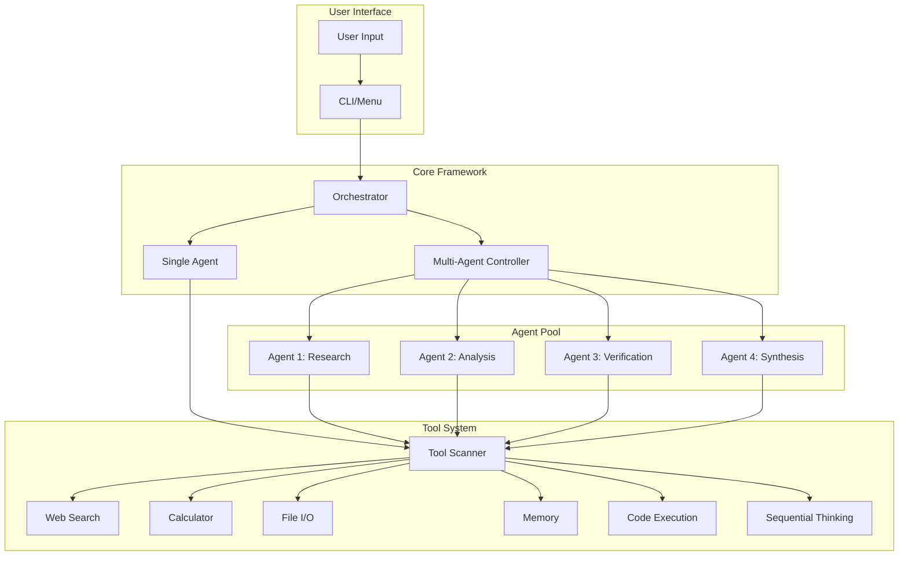

# 🚀 Chat with Tools Framework

<div align="center">

[](https://www.python.org/downloads/)
[](LICENSE)
[](https://github.com/psf/black)
[](https://github.com/Suparious/chat-with-tools/pulls)

**A powerful multi-agent AI framework with tool integration**  
*Inspired by Grok's deep thinking mode*

[Features](#-features) • [Quick Start](#-quick-start) • [Usage](#-usage) • [Architecture](#-architecture) • [Tools](#-available-tools) • [Contributing](#-contributing)

</div>

---

## 🌟 Features

### Core Capabilities

- **🧠 Multi-Agent Intelligence**: Deploy multiple specialized agents working in parallel
- **🛠️ Extensible Tool System**: Auto-discover and hot-swap tools via plugin architecture  
- **⚡ Real-Time Orchestration**: Live progress tracking during multi-agent execution
- **🎯 Dynamic Analysis**: AI-generated research questions for comprehensive coverage
- **🔄 Intelligent Synthesis**: Combine multiple perspectives into unified insights

### Two Powerful Modes

#### 💬 **Single Agent Mode**
Perfect for straightforward tasks with full tool access
- Direct interaction with one intelligent agent
- Access to all available tools
- Ideal for quick queries and simple automation

#### 🧠 **Council Mode (Heavy)**  
Deep multi-perspective analysis inspired by Grok
- 4+ agents working in parallel
- Each agent tackles different aspects
- Comprehensive synthesis of all findings
- Perfect for complex research and analysis

## 🚀 Quick Start

### Prerequisites

- Python 3.8 or higher
- [uv](https://github.com/astral-sh/uv) package manager (recommended)
- OpenRouter API key ([get one here](https://openrouter.ai/keys))

### Installation

```bash
# Clone the repository
git clone https://github.com/Suparious/chat-with-tools.git
cd chat-with-tools

# Install with uv (recommended)
uv venv
source .venv/bin/activate  # On Windows: .venv\Scripts\activate
uv pip install -r requirements.txt

# Or install with pip
pip install -r requirements.txt
```

### Configuration

```bash
# Copy the example configuration
cp config/config.example.yaml config/config.yaml

# Edit config/config.yaml and add your OpenRouter API key
# Replace "YOUR API KEY HERE" with your actual key
```

### First Run

```bash
# Launch the interactive menu
python main.py

# Or use the CLI directly
./cwt chat        # Single agent mode
./cwt council     # Multi-agent council mode
./cwt tools       # Test tools without API
```

## 💡 Usage

### Interactive Menu

The easiest way to get started:

```bash
python main.py
```

This launches an interactive menu with all features:
- Single Agent Chat
- Council Mode (Heavy)
- Tool Testing
- Configuration Management
- Test Suite
- Documentation

### Command Line Interface

Use the `cwt` CLI for direct access:

```bash
# Single agent chat
./cwt chat

# Multi-agent council with 6 agents
./cwt council --agents 6

# Test tools interactively
./cwt tools

# Check configuration
./cwt config --check

# Run tests
./cwt test --coverage
```

### Make Commands

Convenient shortcuts for development:

```bash
make install      # Install dependencies
make run          # Launch interactive menu
make chat         # Start single agent
make council      # Start council mode
make test         # Run test suite
make format       # Format code
make build        # Build for PyPI
```

## 🏗️ Architecture

### System Overview



### How Council Mode Works

1. **Query Analysis**: AI analyzes your question
2. **Question Generation**: Creates specialized sub-questions  
3. **Parallel Execution**: Multiple agents work simultaneously
4. **Tool Utilization**: Each agent uses relevant tools
5. **Result Synthesis**: AI combines all findings
6. **Comprehensive Response**: Delivers multi-faceted answer

## 🛠️ Available Tools

### Core Tools

| Tool | Purpose | Key Features |
|------|---------|--------------|
| **Web Search** | Internet research | DuckDuckGo integration, result parsing |
| **Calculator** | Mathematical operations | Safe evaluation, complex expressions |
| **File I/O** | File manipulation | Read, write, create, delete files |
| **Task Complete** | Signal completion | Mark tasks done, provide summaries |

### Advanced Tools

| Tool | Purpose | Key Features |
|------|---------|--------------|
| **Sequential Thinking** | Step-by-step reasoning | Revisions, branching, confidence tracking |
| **Memory** | Persistent storage | Tags, search, categorization |
| **Python Executor** | Code execution | Sandboxed, resource limited, safe |
| **Summarizer** | Text analysis | Extractive summarization, key points |

### Adding Custom Tools

Create new tools easily:

```python
# src/tools/my_custom_tool.py
from .base_tool import BaseTool

class MyCustomTool(BaseTool):
    @property
    def name(self) -> str:
        return "my_custom_tool"
    
    @property
    def description(self) -> str:
        return "What this tool does"
    
    @property
    def parameters(self) -> dict:
        return {
            "type": "object",
            "properties": {
                "input": {"type": "string", "description": "Input data"}
            },
            "required": ["input"]
        }
    
    def execute(self, **kwargs) -> dict:
        input_data = kwargs.get("input")
        # Your tool logic here
        return {"status": "success", "result": f"Processed: {input_data}"}
```

The tool is automatically discovered and available!

## ⚙️ Configuration

### Key Settings

```yaml
# config/config.yaml

openrouter:
  api_key: "your-key-here"
  model: "openai/gpt-4-mini"  # or any OpenRouter model
  
orchestrator:
  parallel_agents: 4          # Number of agents in council mode
  task_timeout: 300          # Seconds per agent
  
agent:
  max_iterations: 10         # Max tool calls per query
  temperature: 0.7           # Response creativity (0-1)
```

### Supported Models

Works with any OpenRouter-compatible model:

- **OpenAI**: gpt-4, gpt-3.5-turbo
- **Anthropic**: claude-3-opus, claude-3-sonnet
- **Google**: gemini-pro, gemini-flash
- **Meta**: llama-3.1-70b, llama-3.1-8b
- **Open Source**: mixtral, deepseek, qwen

## 📁 Project Structure

```
chat-with-tools/
├── src/                    # Core framework
│   ├── agent.py           # Single agent implementation
│   ├── orchestrator.py    # Multi-agent orchestration
│   └── tools/             # Tool implementations
├── demos/                  # Example applications
├── tests/                  # Test suite
├── config/                 # Configuration files
├── docs/                   # Documentation
├── main.py                # Interactive launcher
├── cwt                    # CLI interface
├── Makefile              # Development commands
├── pyproject.toml        # Modern Python packaging
└── requirements.txt      # Dependencies
```

## 🧪 Testing

Run the comprehensive test suite:

```bash
# Run all tests
make test

# With coverage report
make test-cov

# Quick tests only (no API calls)
make test-quick

# Watch mode (auto-run on changes)
make watch
```

## 🤝 Contributing

We welcome contributions! Here's how to get started:

1. Fork the repository
2. Create a feature branch (`git checkout -b feature/amazing-feature`)
3. Make your changes
4. Run tests (`make test`)
5. Format code (`make format`)
6. Commit (`git commit -m 'Add amazing feature'`)
7. Push (`git push origin feature/amazing-feature`)
8. Open a Pull Request

### Development Setup

```bash
# Install development dependencies
make dev

# Run all checks before committing
make check

# Create a new tool from template
make new-tool
```

## 📝 License

MIT License with Commercial Attribution

For products with 100K+ users, please include attribution to the Chat with Tools framework.

See [LICENSE](LICENSE) for details.

## 🙏 Acknowledgments

- Built with [OpenRouter](https://openrouter.ai/) for LLM access
- Inspired by Grok's deep thinking capabilities
- Uses [uv](https://github.com/astral-sh/uv) for fast Python package management

## 📊 Performance

| Metric | Single Agent | Council Mode (4 agents) |
|--------|-------------|------------------------|
| Response Time | ~2-3s | ~4-5s |
| Tool Calls/Query | 1-3 | 4-12 |
| Accuracy | Good | Excellent |
| Depth of Analysis | Moderate | Comprehensive |

## 🚦 Status

- ✅ Core framework functional
- ✅ Tool system operational  
- ✅ Multi-agent orchestration working
- 🚧 PyPI package (coming soon)
- 🚧 Web interface (planned)
- 🚧 API server mode (planned)

## 📬 Support

- **Issues**: [GitHub Issues](https://github.com/Suparious/chat-with-tools/issues)
- **Discussions**: [GitHub Discussions](https://github.com/Suparious/chat-with-tools/discussions)
- **Documentation**: [Wiki](https://github.com/Suparious/chat-with-tools/wiki)

---

<div align="center">

**Ready to enhance your AI capabilities?**

```bash
python main.py
```

⭐ Star us on GitHub if you find this useful!

</div>
