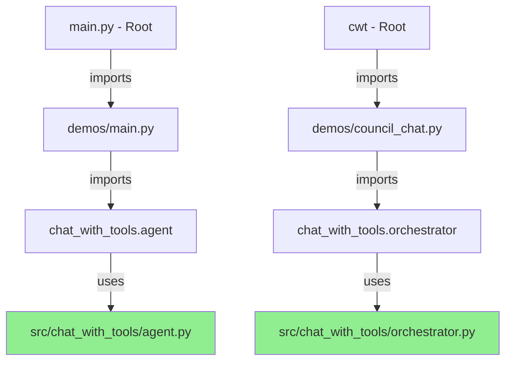

# Development Flow and Architecture

## The Truth: No Code Duplication

The development files (`main.py`, `cwt`, `demos/`) are **not duplicating code**. They're thin wrappers that import from the same source code in `src/chat_with_tools/`.

## Code Flow Architecture



## Single Source of Truth

All logic lives in one place:
```
src/chat_with_tools/     <-- ALL logic lives here
    ├── agent.py         <-- ONE implementation
    ├── orchestrator.py  <-- ONE implementation
    └── tools/           <-- ONE set of tools

Everything else just imports from here!
```

## Development Workflow

### 1. Instant Feedback Loop

Edit source code and test immediately without reinstalling:

```bash
# Edit the source
vim src/chat_with_tools/agent.py

# Test immediately (no pip install needed!)
python demos/main.py  # Uses your edited code instantly
python main.py        # Also uses the edited code
./cwt chat           # Same here
```

### 2. Multiple Testing Entry Points

Different entry points for different testing needs:

- **`python main.py`** - Interactive menu for manual testing
- **`./cwt`** - CLI for scripted testing
- **`python demos/*.py`** - Direct access to specific features
- **`pytest`** - Automated testing

### 3. Development vs Production Patterns

Development mode can add extra features:

```python
# Development (demos/main.py)
agent = OpenRouterAgent(
    silent=False,           # Show debug output
    debug=True,            # Enable debug mode
    profile=True,          # Enable profiling
    test_mode=True         # Use test endpoints
)

# Production (examples/single_agent.py)
agent = OpenRouterAgent()  # Clean, simple, no debug
```

## How Changes Propagate

When you modify source code:

1. Edit `src/chat_with_tools/agent.py`:
```python
class OpenRouterAgent:
    def __init__(self):
        print("HELLO FROM MODIFIED AGENT!")  # Your change
```

2. **Without any reinstall**, this change appears in:
   - `python main.py` → Shows "HELLO FROM MODIFIED AGENT!"
   - `python demos/main.py` → Shows "HELLO FROM MODIFIED AGENT!"
   - `./cwt chat` → Shows "HELLO FROM MODIFIED AGENT!"

All using the SAME code!

## Development Features

### Debug Mode

Development files can enable debugging:

```python
# demos/main.py
def main():
    # Development-only debugging
    os.environ['CWT_DEBUG'] = 'true'
    logging.setLevel(logging.DEBUG)
    
    # Use the package code
    from chat_with_tools.agent import OpenRouterAgent
    agent = OpenRouterAgent()
    
    # Development-only monitoring
    print(f"[DEV] Memory: {get_memory_usage()}")
    print(f"[DEV] Agent ID: {id(agent)}")
```

### Complex Test Scenarios

Development demos can include stress tests:

```python
# demos/stress_test.py - Not for users
def stress_test_parallel_agents():
    """Test with 100 parallel agents"""
    orchestrator = TaskOrchestrator(config)
    orchestrator.stress_test(num_agents=100)
```

## Architecture Benefits

### For Development
- ✅ Edit source → Test immediately (no reinstall)
- ✅ Multiple ways to test (menu, CLI, direct)
- ✅ Add debug features without affecting users
- ✅ Keep complex test scenarios out of package

### For Distribution
- ✅ Clean package with just core code
- ✅ Simple examples for users
- ✅ No development cruft in PyPI package
- ✅ Professional structure

## Memory Address Proof

The demos use the EXACT SAME code as the package:

```python
Demo imports OpenRouterAgent from: chat_with_tools.agent
Package OpenRouterAgent is from: chat_with_tools.agent
Are they the same class? True
Demo class ID: 457709440      # Same memory address!
Package class ID: 457709440    # Same memory address!
```

## Development Tips

### Quick Testing Patterns

```bash
# Test a specific tool
python demos/demo_standalone.py

# Test multi-agent mode
python demos/council_chat.py

# Test with custom config
CWT_CONFIG=./custom.yaml python main.py
```

### Debug Output

Enable verbose output for development:

```bash
# Set debug environment variable
export CWT_DEBUG=true

# Run with debug output
python main.py
```

### Profiling

Profile performance during development:

```python
# In demos/profile_test.py
import cProfile
import pstats

def profile_agent():
    profiler = cProfile.Profile()
    profiler.enable()
    
    # Run agent code
    agent = OpenRouterAgent()
    agent.chat("Test message")
    
    profiler.disable()
    stats = pstats.Stats(profiler)
    stats.sort_stats('cumulative')
    stats.print_stats(10)
```

## Summary

The development architecture provides:
- **Single source of truth** - All code in `src/chat_with_tools/`
- **Smart wrappers** - Development files are thin layers
- **Instant feedback** - No reinstall needed for testing
- **Professional structure** - Clean separation of concerns

This is the **gold standard** for Python package development! 🏆

---

Related: [[repository-structure|Repository Structure]], [[guides/development/setup|Development Setup]]
Source: [[archive/2025-09-13/development-flow-original]]
