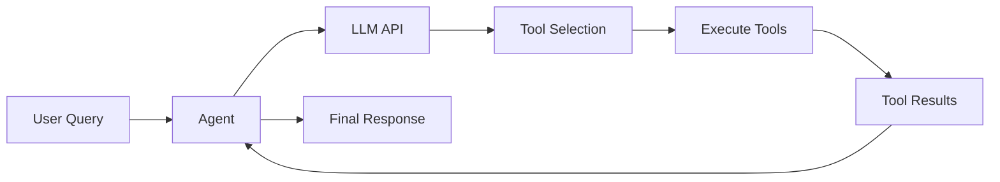
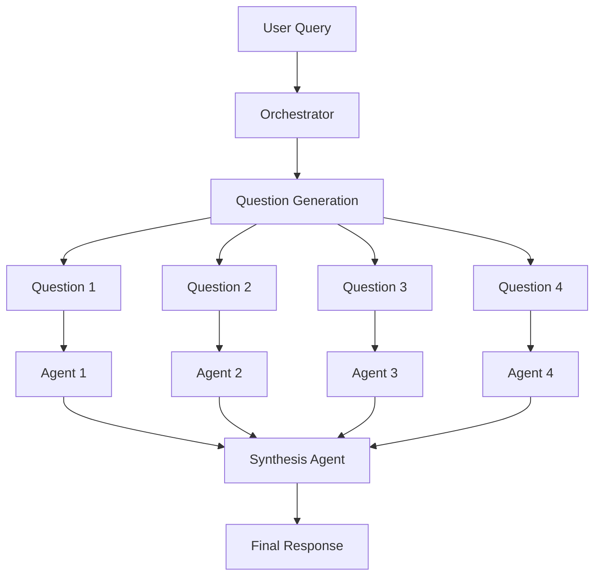

# System Architecture Overview

## Overview

The Chat with Tools framework is a production-ready Python framework that emulates Grok's "heavy mode" deep thinking capabilities through multi-agent orchestration with tool access. It provides a flexible, extensible architecture for building sophisticated AI agents that can work independently or collaboratively.

## Core Mission

Build a framework that excels at:
1. **Accurate use of custom tools** - Agents that reliably select and use the right tools
2. **Parallel multi-agent analysis** - Council mode where multiple agents analyze queries from different perspectives

## Architecture Components

### Core System Architecture

```
src/chat_with_tools/
├── agent.py                 # Single agent implementation with tool loop
├── orchestrator.py          # Multi-agent coordinator for council mode
├── config_manager.py        # Configuration management
├── utils.py                 # Shared utilities and logging
└── tools/                   # Plugin-based tool system
    ├── base_tool.py         # Abstract base class all tools inherit from
    └── *_tool.py            # Individual tool implementations
```

### Key Design Patterns

#### 1. Tool Plugin System

- **Abstract Base Class**: All tools inherit from `BaseTool`
- **Auto-Discovery**: Tools are automatically discovered at runtime from `src/tools/` directory
- **Hot-Swappable**: Add or remove tools without code changes
- **OpenAI Function-Calling Compatible**: Schemas match OpenAI's function calling format

#### 2. Agent Loop Pattern

The core agent follows a conversation loop pattern with tool execution:

```python
while not done and iterations < max_iterations:
    response = llm_call(messages)
    if tool_calls in response:
        execute_tools()
        append_results_to_messages
    else:
        done = True
```

#### 3. Multi-Agent Orchestration

The orchestrator pattern enables parallel agent execution:

- **Question Generation**: AI generates N specialized questions from user query
- **Parallel Execution**: Spawns N agents in parallel threads
- **Context Sharing**: Each agent gets unique question + original context
- **Progress Tracking**: Shared dict with thread locks for real-time status
- **Result Synthesis**: Synthesis agent combines all responses

### System Flow

#### Single Agent Mode



#### Council Mode (Multi-Agent)



## Performance Features

### Connection Management
- **Connection Pooling**: Reuses API client instances for better performance
- **Rate Limiting**: Token bucket algorithm prevents API throttling
- **Retry Logic**: Exponential backoff for robust API calls

### Monitoring & Metrics
- **Metrics Collection**: Tracks API calls, tool usage, and performance
- **Debug Logging**: Comprehensive logging to disk with rotation
- **Performance Tracking**: Token usage, response times, tool execution counts

### Security & Validation
- **Input Validation**: Tool arguments are validated before execution
- **URL Validation**: Security checks for web-based tools
- **Sandboxed Execution**: Python code runs in restricted environment
- **Content Size Limits**: Prevents memory issues with large responses

## Configuration System

The framework uses a layered configuration approach:

1. **YAML Configuration**: Primary configuration in `config/config.yaml`
2. **Environment Variables**: Override specific settings
3. **Runtime Parameters**: Dynamic configuration during execution

### Key Configuration Areas

- **API Settings**: Model selection, API keys, endpoints
- **Agent Behavior**: Iterations, temperature, timeouts
- **Tool Configuration**: Individual tool settings and limits
- **Logging**: Debug levels, file paths, rotation settings
- **Performance**: Connection pooling, caching, metrics

## Extensibility Points

### Adding New Tools

Tools can be added by:
1. Creating a new file in `src/tools/`
2. Inheriting from `BaseTool`
3. Implementing required properties and methods
4. Tool is automatically discovered and available

### Adding New Backends

The framework supports multiple LLM backends:
- OpenRouter (default)
- vLLM (local deployment)
- Custom endpoints (OpenAI-compatible)

### Custom Orchestration

The orchestrator can be extended for:
- Different agent allocation strategies
- Custom synthesis approaches
- Alternative parallel execution models

## Related Documentation

- [[guides/getting-started/index|Getting Started Guide]]
- [[components/agent/overview|Agent Component Details]]
- [[components/orchestrator/overview|Orchestrator Component]]
- [[components/tools/overview|Tools System]]
- [[architecture/adrs/index|Architecture Decision Records]]

## References

- Source: [[archive/agent-summaries-2024-12/technical-handover-document]]
- Implementation: [[archive/agent-summaries-2024-12/implementation-debug-logging-fixes]]
- Framework Review: [[archive/agent-summaries-2024-12/framework-review-improvements]]