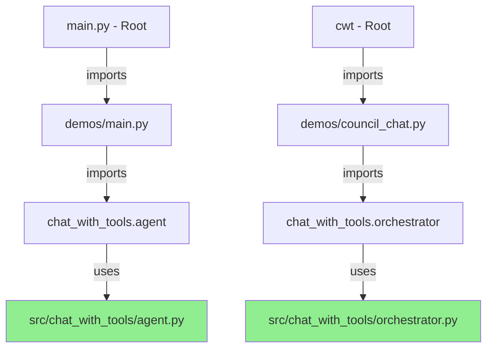

# Development Files Explained - No Duplication!

## The Truth: There's NO Code Duplication

Your development files (`main.py`, `cwt`, `demos/`) are **NOT duplicating code**. They're actually using the SAME source code from `src/chat_with_tools/`. Here's proof:

## Code Flow Diagram



## Actual Code Analysis

### demos/main.py - Look at line 14-15:
```python
# Now import directly from chat_with_tools (not src.chat_with_tools)
from chat_with_tools.agent import OpenRouterAgent  # <-- USING PACKAGE CODE!
```

### demos/council_chat.py:
```python
from chat_with_tools.orchestrator import TaskOrchestrator  # <-- USING PACKAGE CODE!
from chat_with_tools.agent import OpenRouterAgent          # <-- USING PACKAGE CODE!
```

### demos/demo_standalone.py - Lines 18-22:
```python
# Import tools directly from chat_with_tools (not src.chat_with_tools)
from chat_with_tools.tools.sequential_thinking_tool import SequentialThinkingTool
from chat_with_tools.tools.memory_tool import MemoryTool
from chat_with_tools.tools.python_executor_tool import PythonExecutorTool
```

## How Development Files Help You

### 1. **Quick Testing Without Installation**
```bash
# No need to run pip install, just:
python main.py        # Instantly test changes
python demos/main.py  # Test specific features
```

### 2. **Development-Specific Features**
```python
# demos/ can have extra debugging that users don't need:
if DEBUG_MODE:
    print(f"[DEBUG] Agent state: {agent._internal_state}")
    print(f"[DEBUG] Tool calls: {tool_calls}")
```

### 3. **Complex Test Scenarios**
```python
# demos/stress_test.py - Not for users, just for you
def stress_test_parallel_agents():
    """Test with 100 parallel agents - not something users need"""
    orchestrator = TaskOrchestrator(config)
    orchestrator.stress_test(num_agents=100)
```

### 4. **Different Entry Points for Different Needs**
- `main.py` - Interactive menu for manual testing
- `cwt` - CLI for scripted testing
- `demos/*.py` - Direct access to specific features
- `pytest` - Automated testing

## The Architecture Benefits

### Single Source of Truth
```
src/chat_with_tools/     <-- ALL logic lives here
    ├── agent.py         <-- ONE implementation
    ├── orchestrator.py  <-- ONE implementation
    └── tools/           <-- ONE set of tools

Everything else just imports from here!
```

### Development Layer (Thin Wrappers)
```python
# demos/main.py is just a wrapper:
def main():
    # Maybe add some development-specific setup
    os.environ['DEBUG'] = 'true'
    
    # Then use the ACTUAL package
    from chat_with_tools.agent import OpenRouterAgent
    agent = OpenRouterAgent()
    
    # Maybe add development-specific output
    print(f"[DEV] Memory usage: {get_memory_usage()}")
```

## Why This is Perfect for Development

### 1. **Instant Feedback Loop**
```bash
# Edit src/chat_with_tools/agent.py
vim src/chat_with_tools/agent.py

# Test immediately (no pip install needed!)
python demos/main.py  # Uses your edited code instantly
```

### 2. **Different Testing Modes**
```bash
# Quick test
python demos/main.py

# Full integration test  
python main.py

# CLI test
./cwt chat --model gpt-4

# Automated tests
pytest tests/
```

### 3. **Development vs Production**
```python
# Development (demos/main.py)
agent = OpenRouterAgent(
    silent=False,           # Show debug output
    debug=True,            # Enable debug mode
    profile=True,          # Enable profiling
    test_mode=True         # Use test endpoints
)

# Production (examples/single_agent.py)
agent = OpenRouterAgent()  # Clean, simple, no debug
```

## What About the Examples Module?

The `examples/` module I created is slightly different:
- **Purpose**: Provide clean, simple examples for end users
- **Relationship**: Also imports from the main package
- **Duplication?**: Some logic is similar to demos/ but simplified

### Could We Eliminate Even This?

Yes! We could make demos/ even thinner:

```python
# demos/main.py could just be:
from chat_with_tools.examples import run_single_agent

def main():
    # Add development features
    os.environ['DEBUG'] = 'true'
    
    # Call the package version
    run_single_agent()
```

## The Bottom Line

Your setup is actually very clean:
1. **One source of truth**: `src/chat_with_tools/`
2. **Development helpers**: `main.py`, `cwt`, `demos/` (thin wrappers)
3. **User examples**: `src/chat_with_tools/examples/` (for PyPI distribution)

There's **no code duplication** of core logic. The development files are just convenient wrappers that:
- Add development-specific features (debugging, profiling)
- Provide different entry points for testing
- Allow quick iteration without reinstalling

This is exactly how professional Python projects are structured! 🎉
